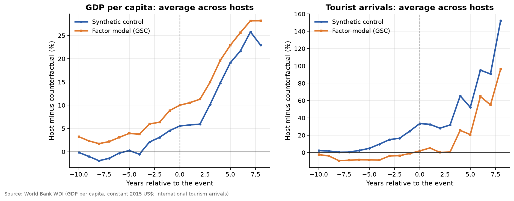
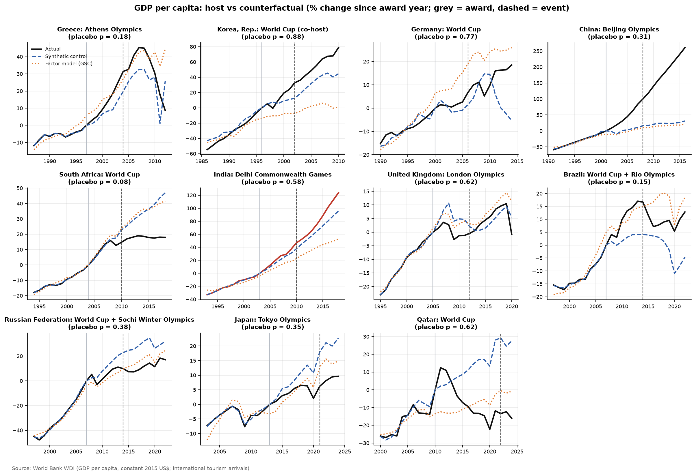
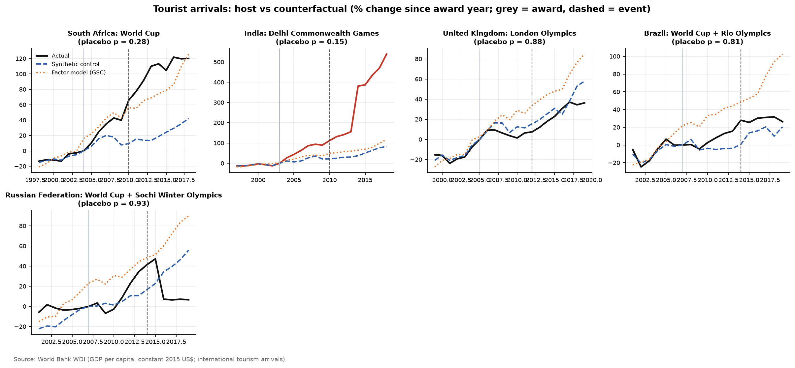

# The Hosting Dividend: Do the Olympics and the World Cup Pay Off?

Governments bid billions to host mega-events, promising a lasting boost to growth, tourism and global visibility. Economists are sceptical, and the ex-post studies commissioned by host cities are rarely independent. This repo asks a simple counterfactual question for **11 hosts, 2002–2022**, including India's Delhi Commonwealth Games (2010):

> *How would the host's economy have evolved if it had never been awarded the event?*

## Data
World Bank WDI API, pulled live:
- GDP per capita, constant 2015 US$ (`NY.GDP.PCAP.KD`), 1980 onwards
- International tourist arrivals (`ST.INT.ARVL`)

**Donor pool:** countries with more than 1 million people that have *not* hosted or been awarded a comparable event between 1988 and 2034, with a complete series over the window. For each host, donors are restricted to countries at a **comparable level** in the award year (GDP per capita or arrivals within a factor of 2.5, widened only if fewer than 12 qualify), and then to the **25 with the closest pre-award paths**. Without this restriction, rich hosts get matched to poor countries that happened to grow at the same pace, which biases the counterfactual (Abadie 2021).

| Host | Event | Awarded | Held |
|---|---|---|---|
| South Korea | FIFA World Cup (co-host) | 1996 | 2002 |
| Greece | Athens Olympics | 1997 | 2004 |
| Germany | FIFA World Cup | 2000 | 2006 |
| China | Beijing Olympics | 2001 | 2008 |
| South Africa | FIFA World Cup | 2004 | 2010 |
| India | Delhi Commonwealth Games | 2003 | 2010 |
| UK | London Olympics | 2005 | 2012 |
| Brazil | World Cup 2014 + Rio Olympics 2016 | 2007 | 2014 |
| Russia | World Cup 2018 + Sochi Winter Olympics 2014 | 2007 | 2014 |
| Japan | Tokyo Olympics | 2013 | 2021 |
| Qatar | FIFA World Cup | 2010 | 2022 |

## Method
Each series is indexed to the **award year**, because spending starts when the bid is won, not when the event opens. Two counterfactuals are built for each host and outcome:

1. **Synthetic control** (Abadie, Diamond & Hainmueller 2010). A weighted average of donor countries, with non-negative weights summing to one, chosen to match the host's 10 pre-award years.
2. **Generalised synthetic control / interactive fixed effects** (Xu 2017), a machine-learning factor model:
   `Y_it = u_i + v_t + λ_i′ f_t + ε_it`
   Latent global factors `f_t` are learned from donors by SVD. The host's loadings `λ_i` are fitted on its pre-period with ridge shrinkage, and the **number of factors (0–2) is chosen by leave-one-year-out cross-validation**. Both limits guard against over-fitting 10 pre-period years. Unlike classic synthetic control, it can follow a host that is growing faster than every donor (e.g. China).

**Inference: placebo in space.** Every donor is treated as if it had hosted, and its post-/pre-period fit ratio is computed. The host's p-value is its rank in that distribution.

## Results
<!-- RESULTS:START -->
_Auto-generated by `run.py` on 2026-09-25. Numbers refresh whenever the pipeline re-runs._

### Headline numbers

- **GDP per capita:** average post-event effect across 11 hosts is **+10.0%** (synthetic control) and **+15.3%** (factor model). 1 of 11 hosts show an effect larger than 90% of placebo countries.
- **Tourist arrivals:** average post-event effect across 5 hosts is **+46.3%** (synthetic control) and **+14.4%** (factor model). 0 of 5 hosts show an effect larger than 90% of placebo countries.
- **India (Delhi 2010):** +8.4% vs synthetic India (placebo p = 0.58).

### Host-by-host estimates

| Outcome | Host | Event | Avg effect, synth control (%) | Avg effect, factor model (%) | Placebo p-value | Factors (CV) | Pre-fit RMSE | Top donors |
|---|---|---|---|---|---|---|---|---|
| GDP per capita | Greece | Athens Olympics 2004 | 6.37 | -4.08 | 0.18 | 2 | 0.00 | Libya (0.35), Hungary (0.24), Puerto Rico (US) (0.18), Cyprus (0.11) |
| GDP per capita | Korea, Rep. | World Cup (co-host) 2002 | 16.16 | 53.97 | 0.88 | 2 | 0.11 | Chile (0.86), Kuwait (0.14) |
| GDP per capita | Germany | World Cup 2006 | 7.61 | -9.16 | 0.77 | 2 | 0.02 | Oman (0.97), Finland (0.03) |
| GDP per capita | China | Beijing Olympics 2008 | 126.40 | 141.48 | 0.31 | 2 | 0.02 | Honduras (0.31), Iraq (0.20), Albania (0.19), Timor-Leste (0.11) |
| GDP per capita | South Africa | World Cup 2010 | -12.19 | -12.17 | 0.08 | 2 | 0.00 | Egypt, Arab Rep. (0.33), Thailand (0.24), Ecuador (0.23), Dominican Republic (0.10) |
| GDP per capita | India | Delhi Commonwealth Games 2010 | 8.39 | 29.34 | 0.58 | 2 | 0.01 | Lao PDR (0.35), Viet Nam (0.26), Senegal (0.09), Uganda (0.09) |
| GDP per capita | United Kingdom | London Olympics 2012 | 0.53 | -3.23 | 0.62 | 2 | 0.00 | Slovenia (0.38), Finland (0.29), Oman (0.18), Bahrain (0.11) |
| GDP per capita | Brazil | World Cup + Rio Olympics 2014 | 11.46 | -5.34 | 0.15 | 2 | 0.00 | Guatemala (0.36), Jamaica (0.17), Venezuela, RB (0.13), Thailand (0.13) |
| GDP per capita | Russian Federation | World Cup + Sochi Winter Olympics 2014 | -12.85 | -4.13 | 0.38 | 2 | 0.01 | Kazakhstan (0.53), Cuba (0.28), Thailand (0.19) |
| GDP per capita | Japan | Tokyo Olympics 2021 | -10.06 | -5.18 | 0.35 | 2 | 0.01 | Bahrain (0.37), Denmark (0.32), Ireland (0.17), Singapore (0.10) |
| GDP per capita | Qatar | World Cup 2022 | -32.26 | -12.97 | 0.62 | 2 | 0.04 | Singapore (0.85), Oman (0.15) |
| Tourist arrivals | South Africa | World Cup 2010 | 65.82 | 13.22 | 0.28 | 2 | 0.02 | Ireland (0.77), Finland (0.14), Jordan (0.10) |
| Tourist arrivals | India | Delhi Commonwealth Games 2010 | 168.10 | 129.77 | 0.15 | 2 | 0.01 | Romania (0.52), Jamaica (0.15), Cyprus (0.13), Dominican Republic (0.11) |
| Tourist arrivals | United Kingdom | London Olympics 2012 | -5.91 | -19.30 | 0.88 | 2 | 0.03 | Ireland (0.67), Egypt, Arab Rep. (0.18), Singapore (0.15) |
| Tourist arrivals | Brazil | World Cup + Rio Olympics 2014 | 13.86 | -24.14 | 0.81 | 1 | 0.04 | Puerto Rico (US) (0.71), Cuba (0.22), Israel (0.07) |
| Tourist arrivals | Russian Federation | World Cup + Sochi Winter Olympics 2014 | -10.20 | -27.39 | 0.93 | 2 | 0.16 | Hungary (1.00) |

### Figures

**Average event study**



**GDP per capita by host**



**Tourist arrivals by host**



<!-- RESULTS:END -->

## Reproduce
```bash
pip install -r requirements.txt
python run.py
```
The GitHub Action pulls WDI and re-runs everything on push and monthly.

## Limitations
- GDP is a blunt measure. Effects on a host *city* (Delhi, London) are diluted at national level.
- Some hosts overlap with big shocks: the 2008 financial crisis, Greece's debt crisis, sanctions on Russia after 2014, COVID in Tokyo 2021. The placebo p-values show how unusual a host's path is, but cannot attribute it to the event alone.
- Tourism windows stop in 2019, because COVID wiped out tourism everywhere and would swamp any event effect. Hosts with too few pre-COVID post-event years drop out of the tourism analysis.

## References
- Abadie, A., Diamond, A. & Hainmueller, J. (2010). *Synthetic control methods for comparative case studies.* JASA.
- Xu, Y. (2017). *Generalized synthetic control method.* Political Analysis.
- Abadie, A. (2021). *Using synthetic controls: feasibility, data requirements, and methodological aspects.* Journal of Economic Literature.
- Baade, R. & Matheson, V. (2016). *Going for the gold: the economics of the Olympics.* Journal of Economic Perspectives.
